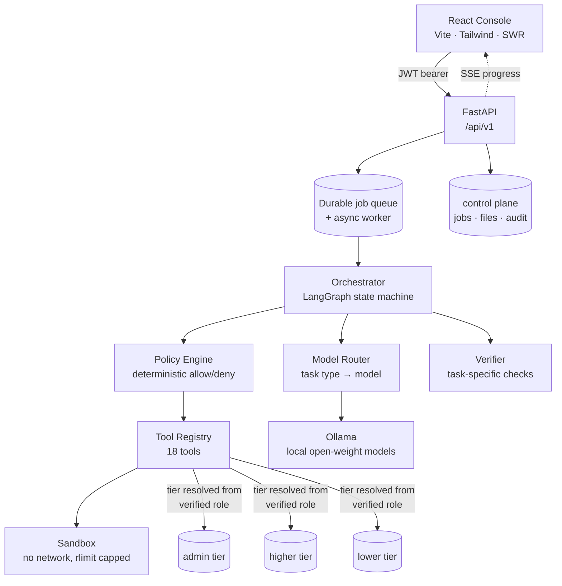
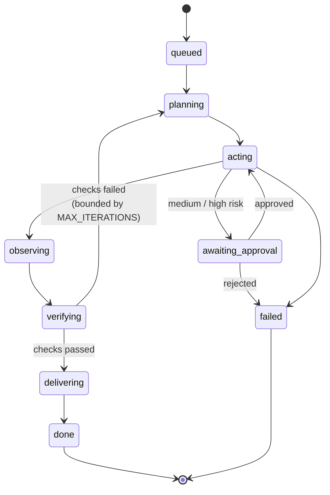

# UPTOWN_FUNC

## Smart India Hackathon 2026 — Problem Statement #117

### Sovereign On-Premise Agentic AI Workbench using Open-Weight Multimodal LLMs for Confidential Industrial Work

**Organization:** Mangalore Refinery and Petrochemicals Limited (MRPL)
**Theme:** Smart Automation
**Team:** UPTOWN_FUNC

---

## 1. Project Overview

Industrial organizations work with large volumes of confidential information such as technical documents, Standard Operating Procedures (SOPs), maintenance records, reports, spreadsheets, engineering data, and internal databases.

Using cloud-based AI services for such information can introduce concerns regarding **data confidentiality, data sovereignty, network dependency, vendor lock-in, and control over AI-driven operations**.

**UPTOWN_FUNC** addresses this problem by developing an **on-premise AI workbench** that enables organizations to use open-weight AI models, internal knowledge, and controlled automation tools while keeping sensitive workloads within their own infrastructure.

The platform brings together:

* Local Large Language Models (LLMs)
* Multimodal AI models
* Document processing
* Retrieval-Augmented Generation (RAG)
* Agent-based task orchestration
* Controlled tool execution
* Sandboxed computation
* Document and report generation
* Verification and audit logging

The objective is to provide a **controlled and extensible AI environment for confidential industrial work**.

---

# 2. Problem Statement

### The Challenge

Industrial organizations need AI assistance for tasks such as:

* Searching technical documentation
* Understanding large document repositories
* Analysing reports and spreadsheets
* Extracting information from scanned documents
* Generating reports and presentations
* Performing calculations and data analysis
* Automating repetitive knowledge-work tasks

However, sensitive industrial information cannot always be sent to external cloud AI services.

This creates several challenges:

| Challenge                | Concern                                                                |
| ------------------------ | ---------------------------------------------------------------------- |
| Confidential information | Sensitive data may leave the organization's infrastructure             |
| Cloud dependency         | AI functionality depends on external services and connectivity         |
| Data sovereignty         | Organizations have limited control over where information is processed |
| Vendor dependency        | Applications can become tightly coupled to a specific AI provider      |
| Autonomous actions       | Uncontrolled AI tool access can create security risks                  |
| Lack of traceability     | It can be difficult to determine how an AI result was produced         |

### Required Direction

The solution should allow AI to work with confidential organizational information while providing:

**Local processing + controlled access + useful automation + traceability**

---

# 3. Proposed Solution

UPTOWN_FUNC implements a **Sovereign AI Workbench** where the major components required for an AI-assisted workflow can operate inside the organization's infrastructure.

At a high level:

```text
                    ┌─────────────────────┐
                    │        USER         │
                    └──────────┬──────────┘
                               │
                               ▼
                    ┌─────────────────────┐
                    │    AI WORKBENCH     │
                    │                     │
                    │ Task Understanding  │
                    │ Planning             │
                    │ Orchestration        │
                    └──────────┬──────────┘
                               │
              ┌────────────────┼────────────────┐
              │                │                │
              ▼                ▼                ▼
       ┌─────────────┐  ┌─────────────┐  ┌─────────────┐
       │ Local Models│  │ Local RAG   │  │ Tool System │
       │             │  │             │  │             │
       │ LLM         │  │ Documents   │  │ Files       │
       │ Vision      │  │ Retrieval   │  │ Python      │
       │ Embeddings  │  │ Knowledge   │  │ Reports     │
       └──────┬──────┘  └──────┬──────┘  └──────┬──────┘
              │                │                │
              └────────────────┼────────────────┘
                               │
                               ▼
                    ┌─────────────────────┐
                    │    VERIFICATION     │
                    │                     │
                    │ Validation          │
                    │ Policy Checks       │
                    │ Approval            │
                    └──────────┬──────────┘
                               │
                               ▼
                    ┌─────────────────────┐
                    │   AUDIT & OUTPUT    │
                    │                     │
                    │ Results             │
                    │ Reports             │
                    │ Generated Files     │
                    └─────────────────────┘
```

---

# 4. Tiered Access Model

The requirement that sensitive information "stays inside the organisation" is only
half the problem. Once a local model retrieves from a single shared index, every
user's question is answered from every user's documents, and the only thing between
a junior technician and a board-level strategy memo is a system prompt asking the
model to be careful.

Prompt-level access control is not access control. It fails to prompt injection, it
fails to jailbreaks, and it fails silently.

This platform therefore treats **the model as never being an authorisation
boundary.** Retrieval content lives in three physically separate databases, one per
access tier, and read access cascades downward:

```text
admin   ──reads──>  admin + higher + lower
higher  ──reads──>           higher + lower
lower   ──reads──>                    lower
```

The tier is resolved server-side from the caller's verified JWT claims, never from
anything the client sends. A `lower`-tier user's query never opens a connection to
the `admin` database, so the model cannot receive that context — the query that
would have retrieved it was never issued.

Each uploaded document is written into exactly one tier:

| Role | Upload scope | Written to | Readable by |
| ---- | ------------ | ---------- | ----------- |
| `admin` | `private` | admin DB | admin |
| `admin` | `everyone` | lower DB | admin, higher, lower |
| `higher` | `restricted` | higher DB | admin, higher |
| `higher` | `everyone` | lower DB | admin, higher, lower |
| `lower` | `private` | lower DB | lower |

Because read access cascades, an "everyone" upload is written once — to the lower
database — and becomes visible to every tier above it.

This is implemented in `app/access.py` and `app/rag/tiered.py`, and is covered by a
dedicated test suite in `tests/test_tiered_access.py`, including cases asserting
that an admin-private upload is invisible to other tiers, that a higher-tier
restricted upload is hidden from lower, and that unknown or ambiguous roles resolve
to least privilege rather than failing open.

---

# 5. How the System Works

A typical user request passes through several stages.

### Step 1 — User Request

The user submits a task such as:

> "Analyse the maintenance reports for the last quarter and prepare a summary."

### Step 2 — Task Classification

The orchestrator determines what type of work is required.

For example:

```text
Document Analysis
        +
Knowledge Retrieval
        +
Data Processing
        +
Report Generation
```

### Step 3 — Planning

The system determines the operations required to complete the task.

```text
Understand request
       ↓
Find relevant documents
       ↓
Retrieve required information
       ↓
Analyse data
       ↓
Generate report
       ↓
Verify result
```

### Step 4 — Local Model / Tool Selection

The orchestrator selects appropriate local models and registered tools.

### Step 5 — Execution

The selected operations are executed within the controlled environment.

### Step 6 — Verification

Results are checked before being returned to the user.

### Step 7 — Output

The system produces the requested response or artifact, such as:

* Analysis
* Report
* Spreadsheet
* Presentation
* Structured data
* Processed document

---

# 6. Core Components

## 6.1 Agent Orchestrator

The orchestrator is responsible for managing the lifecycle of a task.

```text
Request
   ↓
Classification
   ↓
Planning
   ↓
Model / Tool Selection
   ↓
Execution
   ↓
Observation
   ↓
Verification
   ↓
Result
```

It provides the coordination layer between the user, AI models, knowledge sources, and tools.

---

## 6.2 Local Model Layer

The platform is designed around **open-weight models that can be hosted locally**.

Different models can be used for different workloads:

```text
General Reasoning
        │
        ▼
   General LLM

Coding Tasks
        │
        ▼
   Coding Model

Image / Document Understanding
        │
        ▼
   Vision Model

Knowledge Retrieval
        │
        ▼
   Embedding Model
```

The model interface is separated from the rest of the application, allowing models to be changed without changing the overall orchestration architecture.

---

# 7. Document Intelligence

Industrial information is distributed across multiple formats.

The system supports processing of:

* PDF
* DOCX
* TXT
* Markdown
* CSV
* XLSX
* XLSM
* Images

The document pipeline is:

```text
             Document
                 │
                 ▼
             Ingestion
                 │
                 ▼
        Text / Table / OCR
             Extraction
                 │
                 ▼
            Normalization
                 │
                 ▼
             Chunking
                 │
                 ▼
             Indexing
                 │
                 ▼
            Retrieval
```

This allows users to query organizational documents without requiring the documents themselves to be sent to an external AI service.

---

# 8. Retrieval-Augmented Generation

The RAG layer connects organizational knowledge with the local AI models.

Instead of relying only on the model's pretrained knowledge:

```text
User Query
    │
    ▼
Knowledge Retrieval
    │
    ▼
Relevant Documents
    │
    ▼
Relevant Content
    │
    ▼
Local LLM
    │
    ▼
Grounded Response
```

This approach allows responses to be based on the organization's own documents and information sources.

---

# 9. Multimodal Processing

Industrial information is not limited to plain text.

The platform is designed to work with:

* Text documents
* Scanned PDFs
* Images
* Tables
* Spreadsheets
* Mixed-format documents

OCR and multimodal models can be used when information cannot be obtained directly from document text.

This is particularly relevant for legacy documents and scanned industrial records.

---

# 10. Tool Execution

The agent does not receive unrestricted access to the operating system.

Instead, capabilities are exposed through a **controlled tool registry**.

Examples include:

| Tool             | Function                                          |
| ---------------- | ------------------------------------------------- |
| Document Search  | Search indexed organizational information         |
| File Read        | Read permitted files                              |
| File Write       | Create or modify permitted files                  |
| Python Execution | Perform controlled computation                    |
| OCR              | Extract information from images/scanned documents |
| Database Search  | Query approved data sources                       |
| DOCX Generation  | Generate Word reports                             |
| XLSX Generation  | Generate spreadsheets                             |
| PPTX Generation  | Generate presentations                            |
| Report Export    | Export structured results                         |

This provides a defined interface between AI-generated plans and actual system operations.

### Registered tools

The registry currently exposes eighteen tools (`ToolRegistry.names()`):

`search_documents` · `read_file` · `write_file` · `generate_docx` · `generate_xlsx`
· `generate_pptx` · `generate_pdf` · `ingest_document` · `list_sources` ·
`export_report` · `spreadsheet_profile` · `redact_pii` · `extract_tables` ·
`ocr_document` · `search_db` · `send_email` · `create_calendar_event` ·
`run_python`

A tool the model names that is not in this registry is denied by the policy engine
rather than attempted. There is deliberately no arbitrary-URL fetch tool, so a
document cannot instruct the agent to exfiltrate its own contents.

---

# 11. Sandboxed Execution

Some AI tasks require computation or code execution.

Allowing generated code to execute directly on the host system introduces unnecessary risk.

The platform therefore supports execution within an isolated environment with restrictions such as:

* Network restrictions
* Resource limits
* Controlled filesystem access
* Process isolation
* Execution time limits

The execution model is:

```text
AI Generated Code
        │
        ▼
Tool / Policy Check
        │
        ▼
Restricted Sandbox
        │
        ▼
Execution
        │
        ▼
Result
        │
        ▼
Verification
```

---

# 12. Security Model

Security is incorporated into the system architecture rather than being treated only as an external layer.

### Data Control

Sensitive information can remain within the organization's infrastructure.

### Tool Control

Agents can only use capabilities exposed through registered tools.

### Execution Isolation

Potentially unsafe operations can be performed in restricted environments.

### Policy Enforcement

Operations can be checked against configured policies.

### Human Approval

Selected operations can require explicit user authorization.

### Audit Logging

Important actions can be recorded for traceability.

### Enforced invariants

These are properties the code maintains today, not design intentions:

* The model never makes an authorisation decision — tier routing happens in
  `app/access.py`, before retrieval runs.
* A role's query only ever opens connections to the tier databases that role may
  read.
* Unknown or ambiguous roles resolve to least privilege rather than failing open.
* Unknown tools are denied by default.
* Workspace paths are canonicalised and must resolve under `workspace/<job_id>`.
* Host filesystem paths are never returned to the client; artifacts are served only
  through the API.
* Generated code runs with no network access, capped CPU, memory and file size, and
  no access to the host filesystem or container socket.
* `REQUIRE_POSTGRES=true` refuses to start if any of the four databases is still
  SQLite, so a production deployment cannot silently fall back to per-process files.

---

# 13. Auditability

An enterprise AI system needs to provide visibility into how a result was produced.

The platform can maintain information about:

* Job execution
* Model selection
* Tool calls
* Retrieved sources
* Execution events
* Verification
* Generated artifacts
* Approvals

A simplified execution record can be represented as:

```text
User Request
     │
     ▼
   Job ID
     │
     ├── Model Selection
     │
     ├── Retrieved Sources
     │
     ├── Tool Calls
     │
     ├── Execution Results
     │
     ├── Verification
     │
     └── Final Artifact
```

This provides a foundation for monitoring, debugging, and governance.

---

# 14. Architecture

```text
┌─────────────────────────────────────────────────────────────┐
│                         USER                                │
└─────────────────────────────┬───────────────────────────────┘
                              │
                              ▼
┌─────────────────────────────────────────────────────────────┐
│                    APPLICATION LAYER                        │
│                  Web UI / CLI / API                        │
└─────────────────────────────┬───────────────────────────────┘
                              │
                              ▼
┌─────────────────────────────────────────────────────────────┐
│                   AGENT ORCHESTRATOR                       │
│                                                             │
│     Classification → Planning → Routing → Execution        │
└───────────────┬───────────────────────┬─────────────────────┘
                │                       │
                ▼                       ▼
┌─────────────────────────┐   ┌───────────────────────────────┐
│      MODEL LAYER        │   │         TOOL LAYER            │
│                         │   │                               │
│ Local LLMs              │   │ File Operations               │
│ Coding Models           │   │ Python Execution              │
│ Vision Models           │   │ Document Generation           │
│ Embedding Models        │   │ Database Access               │
└────────────┬────────────┘   └──────────────┬────────────────┘
             │                               │
             └───────────────┬───────────────┘
                             │
                             ▼
┌─────────────────────────────────────────────────────────────┐
│                     KNOWLEDGE LAYER                         │
│                                                             │
│  Ingestion → OCR → Processing → Indexing → Retrieval       │
└─────────────────────────────┬───────────────────────────────┘
                              │
                              ▼
┌─────────────────────────────────────────────────────────────┐
│                  SECURITY & GOVERNANCE                       │
│                                                             │
│  Policies • Sandbox • Approvals • Verification • Audit     │
└─────────────────────────────────────────────────────────────┘
```

### Component view



### Job lifecycle

Every transition below is persisted and streamed to the client over Server-Sent
Events, so the interface reflects the agent's real progress rather than a spinner.



---

# 15. Technology Stack

| Layer | Technologies |
| ----- | ------------ |
| API | FastAPI · Pydantic v2 · Uvicorn |
| Agent | LangGraph state machine, with a dependency-free fallback graph |
| Model runtime | Ollama |
| Models | Qwen3.6 27B (chat / coding) · Qwen3-VL 8B (vision) · BGE-M3 (embeddings, 1024-dim) |
| Retrieval | pgvector embeddings, with lexical fallback when embeddings are unavailable |
| Documents | pypdf · pymupdf · python-docx · python-pptx · openpyxl · Pillow |
| OCR | Tesseract, with an Ollama vision-model fallback |
| Database | PostgreSQL + pgvector in production; SQLite for local development |
| Frontend | React 19 · Vite 8 · Tailwind v4 · SWR · Framer Motion · React Router 7 |
| Auth | JWT bearer with signed claims; dev-login for local use |
| Observability | Prometheus metrics · SSE event stream · audit log |
| Execution | nsjail / bwrap / firejail (Linux) · sandbox-exec (macOS) · rlimits floor |
| Containers | Docker Compose · single-container Podman path |
| Testing | Pytest |

The model registry lives in `config/models.yaml`; models can be swapped, enabled or
disabled there without code changes, and the orchestrator builds a matching adapter
per routed model. The exact model and infrastructure configuration should be chosen
according to available hardware.

---

# 16. API Reference

All routes are served under `/api/v1`. Every route requires a bearer token except
`/health` and `/ready`.

### System

| Method | Path | Purpose |
| ------ | ---- | ------- |
| `POST` | `/auth/dev/login` | Local development login |
| `GET` | `/health` | Liveness probe (unauthenticated) |
| `GET` | `/ready` | Database, workspace, disk and model-service readiness (unauthenticated) |
| `GET` | `/system/capabilities` | Hardware snapshot, configured and recommended model profile |
| `GET` | `/system/network` | Air-gap status and local model reachability |
| `GET` | `/tools` | Registered tool names |
| `GET` | `/models` | Model registry |
| `GET` | `/metrics` | Prometheus exposition |

### Knowledge

| Method | Path | Purpose |
| ------ | ---- | ------- |
| `POST` | `/files` | Upload and index into the caller's authorised tier |
| `GET` | `/files` | List accessible documents |
| `GET` | `/files/scopes` | Upload scopes this role may use |
| `DELETE` | `/files/{file_id}` | Revoke and remove indexed chunks |
| `POST` | `/files/{file_id}/shares` | Grant per-file access |
| `GET` | `/files/{file_id}/shares` | List grants |
| `DELETE` | `/files/shares/{share_id}` | Revoke a grant |
| `POST` | `/knowledge/search` | Tier-scoped retrieval |
| `POST` | `/knowledge/evaluate` | Retrieval quality evaluation |

### Tasks

| Method | Path | Purpose |
| ------ | ---- | ------- |
| `POST` | `/chat` | Conversational turn — creates a job |
| `POST` | `/agent/run` | Single-shot task — creates a job |
| `GET` | `/agent` | Recent jobs, tenant and owner scoped |
| `GET` | `/agent/{job_id}` | Full job record |
| `POST` | `/agent/{job_id}/approve` | Resolve a human-approval gate |
| `POST` | `/agent/{job_id}/cancel` | Cancel a running job |
| `GET` | `/agent/{job_id}/events` | SSE progress stream |
| `GET` | `/agent/{job_id}/artifacts` | List generated deliverables |
| `GET` | `/agent/{job_id}/artifacts/{name}` | Download a deliverable |

### Conversations

| Method | Path | Purpose |
| ------ | ---- | ------- |
| `POST` | `/conversations` | Create a session |
| `GET` | `/conversations` | List sessions |
| `GET` | `/conversations/{id}` | Session with full message history |
| `GET` | `/conversations/{id}/messages` | Messages only |

---

# 17. Repository Structure

```text
SIH-2026-TEAM-UPTOWN_FUNC/
│
├── sovereign-agent-orchestrator/
│   │
│   ├── app/
│   │   ├── access.py          Role → tier database routing (the core invariant)
│   │   ├── api/routes.py      The entire HTTP surface
│   │   ├── orchestrator/      LangGraph state machine
│   │   ├── models/            Model registry + per-model Ollama adapters
│   │   ├── policy/            Deterministic tool allow/deny
│   │   ├── rag/               Tiered retrieval, ingestion, reporting
│   │   ├── tools/             Tool registry + execution sandbox
│   │   ├── verification/      Task-specific completion checks
│   │   ├── storage/           Durable jobs, files, conversations, audit
│   │   └── diagnostics.py     Hardware probe, readiness, auto-configuration
│   │
│   ├── config/
│   │   └── models.yaml        Model registry
│   │
│   ├── frontend/src/
│   │   ├── pages/             Feed · Tasks · Knowledge · Ingest · Artifacts
│   │   ├── components/        Shell, feed, knowledge, shared primitives
│   │   └── hooks/             SWR data hooks + SSE stream
│   │
│   ├── migrations/
│   │   └── Control-plane and per-tier schemas
│   │
│   ├── scripts/
│   │   └── Backup, restore and load-test utilities
│   │
│   ├── tests/
│   │   └── 37 automated tests
│   │
│   ├── ARCHITECTURE.md
│   ├── SYSTEM_GUIDE.md
│   ├── TEAM_SETUP.md
│   ├── ELECTRON_INTEGRATION.md
│   ├── Dockerfile
│   ├── Containerfile
│   ├── docker-compose.yml
│   ├── cli.py
│   ├── pyproject.toml
│   └── requirements.txt
│
└── README.md
```

---

# 18. Installation

## Prerequisites

Depending on the selected deployment configuration:

* Python 3.x
* Git
* Ollama
* Docker or Podman
* Sufficient CPU / RAM / GPU resources for selected local models

---

## Clone the Repository

```bash
git clone https://github.com/hardsubjectParth/SIH-2026-TEAM-UPTOWN_FUNC.git

cd SIH-2026-TEAM-UPTOWN_FUNC
```

Enter the main application:

```bash
cd sovereign-agent-orchestrator
```

---

## Create a Virtual Environment

### Linux / macOS

```bash
python -m venv .venv
source .venv/bin/activate
```

### Windows

```powershell
python -m venv .venv
.venv\Scripts\activate
```

---

## Install Dependencies

```bash
pip install -r requirements.txt
```

---

## Environment Configuration

Create the environment file:

### Linux / macOS

```bash
cp .env.example .env
```

### Windows

```powershell
copy .env.example .env
```

Configure the required application, model, database, and runtime settings in `.env`.
At minimum:

```bash
DEV_AUTH_ENABLED=true
DEV_ADMIN_PASSWORD=<pick-something>
JWT_SECRET=<32+ random characters — dev login returns 503 below that>
```

---

## Running without a model server

`MODEL_MODE=fake` requires no GPU, no Ollama and no model download. Task routing,
tiered retrieval, the sandbox, verification, the SSE stream and artifact generation
are all real — only the generated prose is a fixed placeholder. This is the fastest
way to exercise the whole system, and it is how the test suite runs.

```bash
export MODEL_MODE=fake
.venv/bin/python -m uvicorn app.main:app --host 127.0.0.1 --port 8080
```

---

## Running with local models

```bash
OLLAMA_FLASH_ATTENTION=1 OLLAMA_KV_CACHE_TYPE=q8_0 \
OLLAMA_NUM_PARALLEL=1 OLLAMA_MAX_LOADED_MODELS=1 ollama serve

ollama pull qwen3.6:27b
ollama pull qwen3-vl:8b
ollama pull bge-m3
```

Set `MODEL_MODE=ollama` in `.env`, then start the API as above. `GET /api/v1/ready`
reports whether the database, workspace, disk headroom and both model services are
actually available — check it before filing a bug.

---

## Frontend

```bash
cd frontend
npm install
npm run dev          # http://localhost:5173
```

---

For the complete setup procedure, refer to:

* `SYSTEM_GUIDE.md`
* `TEAM_SETUP.md`
* `start.md`

---

# 19. Container Deployment

The project includes container deployment support.

### Docker

```bash
docker compose up --build
```

For Podman-based deployment, refer to the Podman documentation and configuration files included in the repository.

---

# 20. Testing

Run the automated test suite:

```bash
cd sovereign-agent-orchestrator
MODEL_MODE=fake .venv/bin/python -m pytest -q
```

The suite currently contains **37 tests**, covering:

| Area | Examples |
| ---- | -------- |
| Tier isolation | Admin-private uploads invisible to other tiers; higher-restricted hidden from lower; `everyone` reaching all tiers |
| Least privilege | Unknown or multiple roles resolving to the lowest tier; empty file-id filters matching nothing |
| Policy and paths | Unknown tools denied; workspace traversal blocked |
| Routing | Document, multimodal and the extended task types |
| Documents | CSV, DOCX and PPTX extraction; PDF generation; original-filename citation |
| Sandbox | Code execution with network access blocked; coding tasks gated on exit code |
| Orchestration | Bounded re-planning after verification failure; adapter timeout and error reporting |
| Access control | JWT signed-claim identity; tenant and owner scoping; file sharing and attachment scope |
| Operations | Rate limiting; air-gap detection; the `REQUIRE_POSTGRES` production guard |

Frontend checks:

```bash
cd frontend
npm run build        # type-checks and builds
npm run lint
```

---

# 21. Example Workflow

A representative industrial workflow could look like:

### Request

```text
Analyse a set of maintenance reports and
generate a summary report containing
key findings and relevant observations.
```

### Processing

```text
Request
   ↓
Task Classification
   ↓
Document Search
   ↓
Relevant Report Retrieval
   ↓
Document / Table Processing
   ↓
Local Model Analysis
   ↓
Result Verification
   ↓
Report Generation
```

### Output

```text
Maintenance Analysis Report
├── Executive Summary
├── Relevant Findings
├── Supporting Information
├── Data Analysis
└── Generated Report
```

The same architecture can be adapted to other document-centric and knowledge-intensive industrial workflows.

---

# 22. Design Principles

### Sovereignty

Sensitive workloads should remain within the organization's controlled environment wherever possible.

### Least Privilege

AI agents should receive only the capabilities required for the task.

### Model Independence

The application should not be tightly coupled to one model provider.

### Controlled Autonomy

Agents should be capable of performing multi-step tasks without receiving unrestricted system access.

### Verification

Important results should pass through appropriate validation before delivery.

### Traceability

System actions should be observable and auditable.

### Extensibility

New models, tools, data sources, and workflows should be integrable without redesigning the entire system.

---

# 23. Intended Use Cases

The platform can support a range of confidential industrial knowledge-work scenarios, including:

* Technical document search
* SOP assistance
* Engineering document analysis
* Maintenance report analysis
* Internal knowledge retrieval
* Spreadsheet analysis
* Document summarization
* Automated report generation
* OCR-based document processing
* Controlled data analysis
* Enterprise knowledge assistance

The actual deployment and workflows should be configured according to the organization's security and operational requirements.
---

# 24. Future Scope

The platform can be extended with:

### Enterprise Integration

* Enterprise authentication
* Role-Based Access Control
* Internal databases
* Existing enterprise applications
* Additional document repositories

### Infrastructure

* GPU-based model serving
* Multi-node deployment
* High-availability configuration
* Air-gapped deployment

### Governance

* Advanced policy management
* Fine-grained permissions
* Enhanced audit and monitoring
* Approval workflows

### Industrial Applications

* Maintenance intelligence
* Engineering assistance
* SOP intelligence
* Technical knowledge management
* Operational report analysis

---

# 25. Project Information

|                       |                                                      |
| --------------------- | ---------------------------------------------------- |
| **Event**             | Smart India Hackathon 2026                           |
| **Problem Statement** | #117                                                 |
| **Organization**      | Mangalore Refinery and Petrochemicals Limited (MRPL) |
| **Theme**             | Smart Automation                                     |
| **Team**              | UPTOWN_FUNC                                          |
| **Project**           | Sovereign On-Premise Agentic AI Workbench            |

---

# 26. Team UPTOWN_FUNC

Developed for **Smart India Hackathon 2026** by Team **UPTOWN_FUNC**.

The project focuses on building practical, secure, and locally deployable AI infrastructure for confidential enterprise and industrial workloads.

---

## Disclaimer

This repository contains a prototype developed for Smart India Hackathon 2026.

The system should not be considered production-ready for industrial deployment without appropriate security assessment, performance testing, operational validation, access controls, compliance review, and organizational approval.

---

## License

Add the applicable license here if this project is intended for public distribution.

---

**UPTOWN_FUNC · Smart India Hackathon 2026 · Problem Statement #117**
